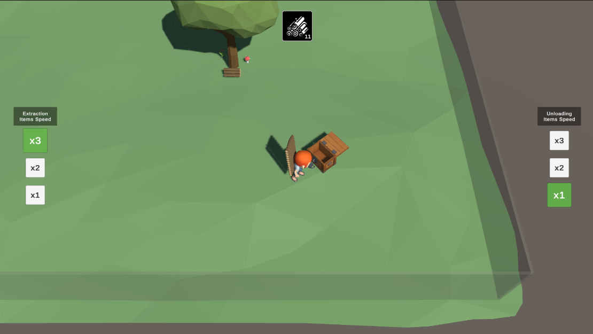

### Реализовать механику добычи и отгрузки ресурсов
---

Добавить 2 ряда кнопок, Слева и Справа. Слева кнопки меняют скорость добычи ресурсов, справа кнопки меняют скорость сдачи ресурсов.
Кнопки Должны быть выделяемыми, Если мы выбираем скорость добычи х1 то он горит зеленым и должны быть чуть больше чем остальные, остальные кнопки по скорости работы должны быть белыми.
То же самое касается и кнопок по скорости сдачи ресурсов. Когда мы сдаем  у нас счетчик на интерфейсе пополняется.

> Всегда выбрано 2 кнопки одна по скорости сдачи другая по скорости добычи.

